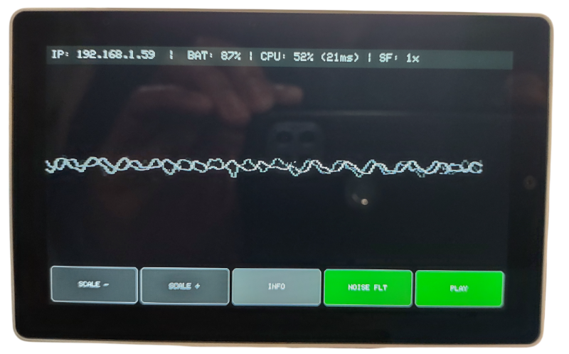

# Tab5 Mic Talk

**A standalone WiFi Mic Data Server With HTML/JS Based Spectrum Analyzer, and VU Meters for the M5Stack Tab5.**

## Introduction

This project turns the **M5Stack Tab5** into a useful network-attached audio analysis tool. Unlike standard visualizers that only show graphics on the device's small screen, this firmware also contains a **Web Server**. It captures raw audio from the built-in I2S microphone, processes it, and streams the raw PCM data over WiFi to any connected client (Smartphone, PC, Tablet).



The device also serves basic **Web Dashboards** containing:

1. **Vintage Analog VU Meters** with realistic ballistics and physics.

2. **Spectrum Visualizer** (64-band FFT) with logarithmic scaling.


This project was developed by modifying the standard M5Stack microphone example sketch, with "vibe coding" assistance from **Gemini 3 Pro** to build out the web server, physics-based VU meters, and FFT spectrum analysis features. Overall it does a good job of serving MIC audio data for the creation of web-based audio visualizer tools, **provided low-latency/stereo inputs are not a requirement.** 

## System Architecture

The system uses a **Client-Server Polling** architecture to ensure somewhat low latency (~30 ms) visualization on remote screens provided the number of clients is 15 or less, based on testing. 

**Note:** If you use Chrome and want to make use of the data API for web pages not loaded directly from local filesystem (i.e using webserver) you will need to disable "[Local Network Access Checks](https://developer.chrome.com/blog/local-network-access)" under the "chrome://flags/" tab, otherwise the connection will be blocked. Firefox doesn't seem to have this issue. 

## Features

- **Dual Operation:** Works standalone (on-screen waveform) and networked (web dashboard) simultaneously.

- **High-Speed Streaming:** Serves raw audio samples at ~25-50 FPS.

- **Web Consoles:**
  
  - Change themes (Dark, Light, Cyber Blue, Matrix Green).
  
  - Switch between LED Bar and Analog Needle styles.
  
  - Adjustable gain (0.5x to 12x).
  
  - Stereo Simulation (adds jitter to mono signal for visual width).

- **Hardware Controls:** Adjust scaling and noise filters directly from the Cardputer keyboard.

- **SD Card Configuration:** Load WiFi credentials from a text file (no recompiling needed to move networks).

## Hardware & Setup

### 1. Requirements

- [M5Stack Tab5](https://docs.m5stack.com/en/core/Tab5) (ESP32-P4)

- Micro SD Card (Formatted FAT32) - **Optional**

### 2. Arduino IDE Setup (Brief)

1. Install the **Arduino IDE**.

2. [Add M5Stack](https://docs.m5stack.com/en/arduino/m5cardputer/program) to the **Board Manager**:
   
   - Go to `File > Preferences`.
   
   - Add this URL: `https://m5stack.oss-cn-shenzhen.aliyuncs.com/resource/arduino/package_m5stack_index.json`

3. Go to `Tools > Board > Boards Manager`, search for **M5Stack**, and install.

4. Select the board: `Tools > Board > M5Stack Arduino > M5Cardputer`.

5. Install Libraries (via `Sketch > Include Library > Manage Libraries`):
   
   - **M5Cardputer**
   
   - **M5Unified**

### 3. Configuration (WiFi Credentials)

You have two options for setting up WiFi:

**Option A: SD Card (Recommended for Portability)**

Create a file named config.txt on the root of your SD card. This allows you to change networks without recompiling.

- **Line 1:** WiFi SSID

- **Line 2:** WiFi Password

**Example `config.txt`:**

```
MyHomeNetwork
SuperSecretPassword123
```

**Option B: Hardcoded (No SD Card Required)**

If you don't have an SD card, you can hardcode your credentials directly into the firmware.

1. Open `CardputerMicTalk.ino`.

2. Locate the fallback settings near the top:
   
   ```
   // --- WI-FI SETTINGS (FALLBACK) ---
   String wifi_ssid = "YOUR_SSID_HERE";
   String wifi_pass = "YOUR_PASSWORD_HERE";
   ```

3. Upload the sketch.

### 4. Compiling

1. Open `tab5MicTalk.ino` in Arduino IDE.

2. Ensure `webapp.h` and `spectrum.h` are in the same folder (tab).

3. Click **Upload**.

## User Guide (Controls)

Once the device is running, it will display **IP Address** and battery level on the top of the screen.

### Touchscreen Buttons

| **Button**    | **Action** | **Description**                                                                                                                                                                                     |
| ------------- | ---------- | --------------------------------------------------------------------------------------------------------------------------------------------------------------------------------------------------- |
| **NOISE FLT** | **PRESS**  | **Adjust Noise Filter (NF).** Increases the squelch floor to ignore background noise. Cycle wraps 0-255.                                                                                            |
| **PLAY**      | **PRESS**  | **Playback.** Stops recording and plays the last ~3 seconds of audio through the speaker (*bug -- currently does not work*).                                                                        |
| **SCALE +**   | **PRESS**  | **Increase Scaling Factor (SF).** Boosts the signal sent to the web app (1x -> 12x).                                                                                                                |
| **SCALE -**   | **PRESS**  | **Decrease Scaling Factor (SF).** Lowers the signal gain.                                                                                                                                           |
| **INFO**      | **PRESS**  | **Display % CPU Usage and Scaling Factor.** Displays the relative % CPU usage based on a 100% being the main loop taking more than 40ms (25 frames/s on client) to run, and current scaling factor. |

### On-Screen Display

- **IP:** Shows the device's IP address.

- **BAT:** Shows current percent battery level.

- **NF LEVEL:** Current Noise Filter level.

- **SF:** Current Scaling Factor level.

- **CPU:** Current Percent CPU Usage and time to run loop (relative)

### Web Interface

1. Look at the Cardputer screen to get the IP address (e.g., `192.168.1.59`).

2. Open a browser on a computer or phone connected to the same WiFi.

3. **Dashboards:**
   
   - **VU Console:** `http://192.168.1.59/` (Analog/Digital VU meters).
   
   - **Spectrum Visualizer:** `http://192.168.1.59/sv` (64-Band FFT Spectrum Visualizer).
   
   - **Raw Data API:** `http://192.168.1.59/data` (JSON output).

## 

## Links & Resources

- **Product Page:** [M5Stack Tab5 IoT Development Kit (ESP32-P4) | m5stack-store](https://shop.m5stack.com/products/m5stack-tab5-iot-development-kit-esp32-p4?variant=46276989255937)

- **Documentation:** [ M5Stack Tab5](https://docs.m5stack.com/en/core/Tab5)

## License

This project is open-source. Feel free to modify and distribute.